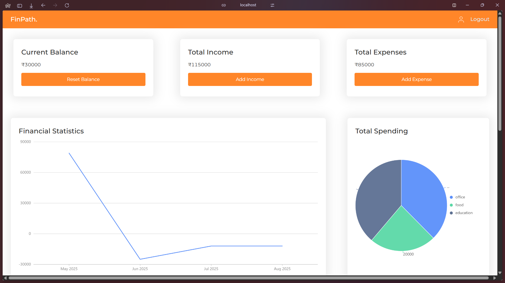
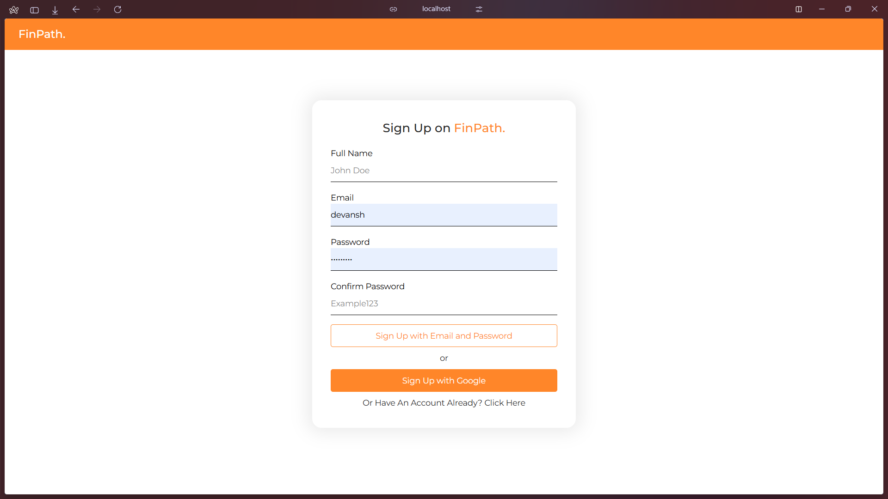
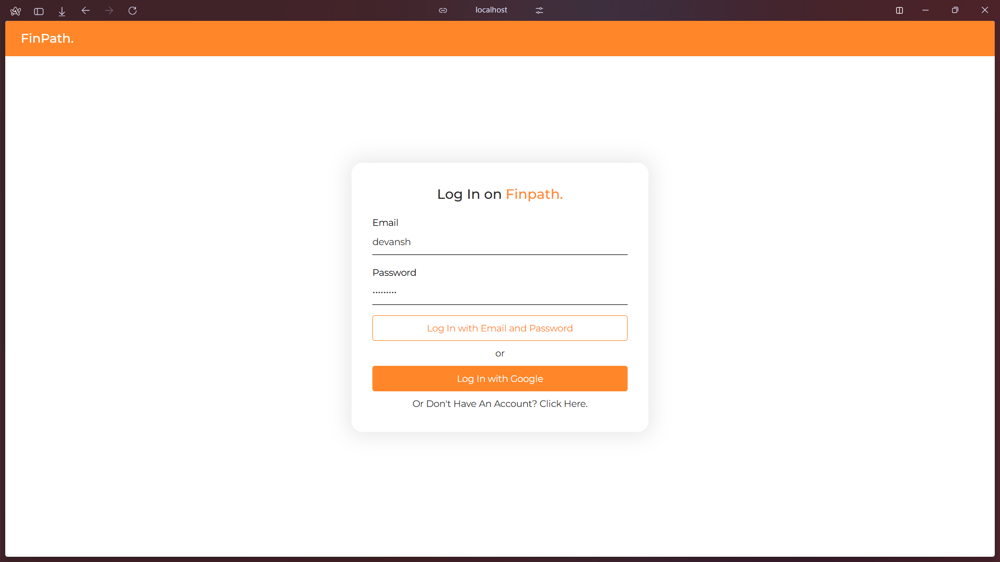
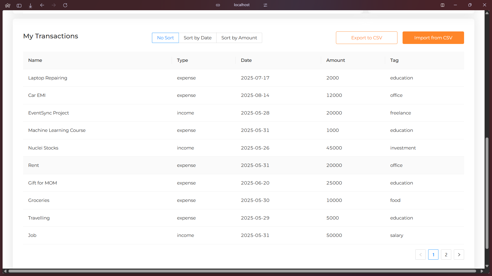

# 💸 Personal Finance Tracker

A modern web application to help you efficiently manage your income and expenses, visualize spending trends, and achieve your financial goals. Built with **React** and **Firebase** for a seamless, real-time experience.

---

## 🚀 Features

- **Secure Authentication:** Sign in with Google for safe access to your data.
- **Add Income & Expenses:** Easily log transactions and categorize them.
- **Real-Time Data:** Instantly updates and syncs across devices using Firebase.
- **Visual Summaries:** View clear summaries and charts of your financial activity.
- **User-Friendly Interface:** Clean, intuitive design for effortless navigation.

---

## 🖼️ Screenshots

<!--
Add your screenshots below. 
To add a screenshot, place the image in a folder (e.g., `/screenshots`) and use the following syntax:
-->

---

## ⚙️ Getting Started

### 1. **Clone the Repository**
git clone https://github.com/yourusername/personal-finance-tracker.git
cd personal-finance-tracker

text

### 2. **Install Dependencies**
npm install

text

### 3. **Set Up Firebase**
- Create a project on [Firebase Console](https://console.firebase.google.com/).
- Enable Authentication (Google Sign-In) and Firestore Database.
- Copy your Firebase config into a `.env` file in the project root:
REACT_APP_FIREBASE_API_KEY=your_api_key
REACT_APP_FIREBASE_AUTH_DOMAIN=your_auth_domain
REACT_APP_FIREBASE_PROJECT_ID=your_project_id
REACT_APP_FIREBASE_STORAGE_BUCKET=your_storage_bucket
REACT_APP_FIREBASE_MESSAGING_SENDER_ID=your_messaging_sender_id
REACT_APP_FIREBASE_APP_ID=your_app_id
REACT_APP_FIREBASE_MEASUREMENT_ID=your_measurement_id

text

### 4. **Start the Application**
npm start

text
Open [http://localhost:3000](http://localhost:3000) to view it in your browser.

---
